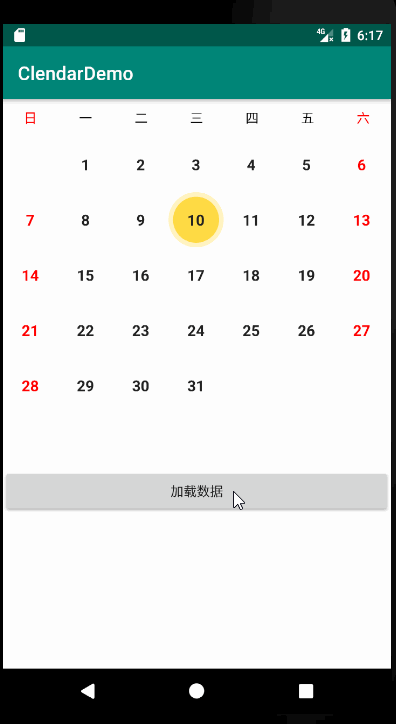

# CalendarView
### 引言
日历控件在android开发中也是比较常见的一个控件,并且目前大部分开源的日历控件也已经做得很漂亮,很完善了,功能也相当丰富;
今天这个日历控件就是我在别人的基础上进行修改了的,首先很感谢这个开源库:
https://github.com/codbking/CalendarExaple;
帮我解决了一个大问题,主要是缓存view的问题;
### 效果
先来看下效果是怎么样的;

##实现步骤
1,最开始我是采用viewpager+fragment+recyclerview进行编写的,这是我自己的思路,并且也已经实现了;只是滑动的时候会出现延时的效果,这个问题不知道是不是我没有做缓存的问题;
具体的代码地址:
https://github.com/mouxuefei/CalendarView/blob/master/app/src/main/java/com/exmple/clendardemo/MainActivity.java

其实主要架构就是viewpager+fragment+recyclerView,效果也是能实现的,但是会有滑动延时;
数据加载和时间是分开设置的;数据需要viewpager切换的时候进行网络加载,我这里只是做了假数据,模拟了一下;

2,然后我看了一下CalendarExaple这个的源码,进行了部分修改;最终实现了我想要的效果;
项目地址如下:
https://github.com/mouxuefei/CalendarView/blob/master/app/src/main/java/com/exmple/clendardemo/SecondActivity.java
